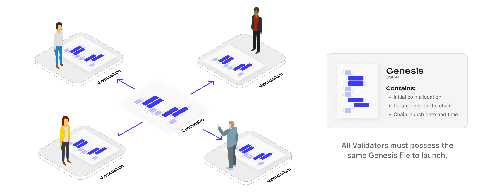
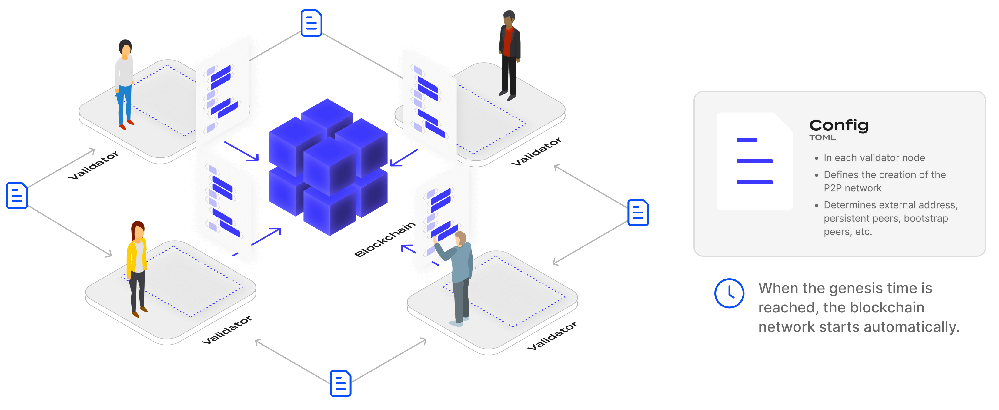
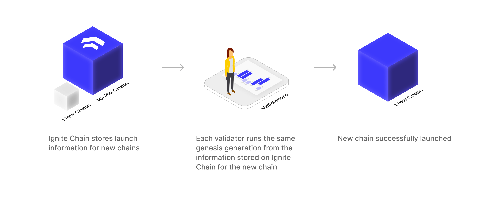
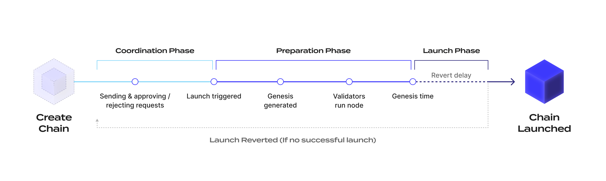

## Introduction

_Ignite is a blockchain to help launch Cosmos SDK-based blockchains._

Using Cosmos SDK and Ignite CLI, developers can quickly create a crypto application that is decentralized, economical for usage, and scalable. The Cosmos SDK framework allows developers to create sovereign application-specific blockchains that become part of the wider [Cosmos ecosystem](https://cosmos.network/ecosystem/apps). Blockchains created with Cosmos SDK use a Proof-of-Stake (PoS) consensus protocol that requires validators to secure the chain.

Even though tools like Ignite CLI simplify the development of a Cosmos SDK blockchain, launching a new chain is a highly complex process. One of the major challenges of developing and launching your own sovereign blockchain is ensuring the security of the underlying consensus. Since Cosmos SDK chains are based on the PoS consensus, each blockchain requires initial coin allocations and validators before they can be launched, which presents developers with significant challenges, such as determining their chain's tokenomics or coordinating a robust validator set.

The initial coin allocations and validators are described in a JSON-formatted genesis file that is shared among all initial nodes in the network. This genesis file defines the initial state of the application. Based on PoS, secure chains require the initial allocation of coins to be well distributed so that no single validator holds more than 1/3 of all tokens and receives a disproportionate amount of voting power.

Along with ensuring the security of the underlying consensus, another highly difficult task in launching a new blockchain is attracting a diverse set of validators for the genesis file. Many promising projects fail to capture the attention of a sufficient number of trustworthy validators to secure their chains due to a lack of resources or experience.

The Ignite Chain has, therefore, been conceived to facilitate the launch of Cosmos SDK blockchains by helping developers to navigate the complexities of launching a blockchain and coordinate the genesis of a new chain. Using the decentralized nature of blockchain, Ignite's coordination features help blockchain builders connect with validators and investors, speeding up the time to market of their projects and chances of success.

Commands to interact with Ignite Chain are integrated into Ignite CLI and allow launching chains from it. Integration with Ignite Chain allows the CLI to support the developer in the entire lifecycle of realizing a Cosmos project, from the development and experimentation of the blockchain to the launch of its mainnet.

## What is Ignite Chain

Ignite Chain is a secure platform that simplifies the launch of Cosmos SDK-based chains, lending vital resources and support at the coordination, preparation, and launch stages. Ignite provides the tools that blockchain projects need to overcome the complexities of launching their chain, from validator coordination and token issuance to fundraising and community building.

Ignite facilitates the launch of new chains with an overall launch process during three phases:

- Coordination
- Preparation
- Launch

To reduce friction at each phase, Ignite provides an immutable and universal database for validator coordination.

In the future, Ignite will also offer:

- Token issuance: Ignite allows the issuance of tokens (called vouchers) that represent a share
  allocation of a future mainnet network
- A fundraising platform for selling vouchers
- A permissionless framework to reward validator activities on a launched testnet network

## Validator coordination

To launch a chain in the Cosmos ecosystem, the validators must start nodes that connect to each other to create the new blockchain network. A node must be started from a file called the genesis file. The genesis file must be identical on all validator nodes before the new chain can be started.



The JSON-formatted genesis file contains information on the initial state of the chain, including coin allocations, the list of validators, various parameters for the chain like the maximum number of validators actively signing blocks, and the specific launch time. Because each validator has the same genesis file, the blockchain network starts automatically when the genesis time is reached.



### Ignite as a coordination source of truth

Ignite Chain acts as a source of truth for new chains to coordinate a validator set and for validators to generate the genesis for a chain launch. The blockchain doesn’t directly store the final genesis file in its own ledger but rather stores information that allows generating the genesis file in a deterministic manner.

The information stored on Ignite that supports deterministic generation of the genesis file for a specific chain launch is referred to as the _launch information_. When creating a new chain on Ignite, the coordinator provides the initial launch information. Then, through on-chain coordination, this launch information is updated by interacting with the blockchain by sending messages. When the chain is ready to be launched, the genesis file is generated by calling a genesis generation algorithm that uses the launch information.

**GenesisGenerate(LaunchInformation) => genesis.json**

The genesis generation algorithm is officially and formally specified. The official implementation of the genesis generation algorithm is developed in Go using Ignite CLI. However, any project is free to develop its own implementation of the algorithm as long as it complies with the specification of the algorithm.

The genesis generation algorithm is not part of the on-chain protocol. In order to successfully launch a new chain, all validators must use the algorithm to generate their genesis using the launch information. The algorithm deterministically generates the genesis from the launch information that is stored on the Ignite chain.

If any element of the launch information is censored, for example, removing an account balance, the launched chain reputation is negatively impacted and implies that the majority of validators agree on not using:

- The tamper-proof launch information
- The official genesis generation algorithm

Outside of the genesis generation, the genesis generation algorithm specification gives guidance on how to set up your network configuration. For example, the launch information can contain the addresses of the persistent peers of the blockchain network.



## Launch information

Launch information can be created or updated in three different ways:

1. Defined during chain creation but updatable by the coordinator after creation
2. Determined through coordination
3. Determined through specific on-chain logic not related to coordination

### 1 - Launch information determined during chain creation

- `GenesisChainID`: The identifier for the network
- `SourceURL`: The URL of the git repository of the source code for building the blockchain
  node binary
- `SourceHash`: The specific hash that identifies the release of the source code
- `InitialGenesis`: A multiformat structure that specifies the initial genesis for the chain
  launch before running the genesis generation algorithm

### 2 - Launch information determined through coordination

- `GenesisAccounts`: A list of genesis accounts for the chain, comprised of addresses with associated balances
- `VestingAccounts`: A list of genesis accounts with vesting options
- `GenesisValidators`: A list of the initial validators at chain launch
- `ParamChanges`: A list of module param changes in the genesis state

### 3 - Launch information determined through on-chain logic

- `GenesisTime`: The timestamp for the network start, also referred to as LaunchTime

### Initial genesis

The launch information contains the initial genesis structure. This structure provides the information for generating the initial genesis before running the genesis generation algorithm and finalizing the genesis file.

The initial genesis structure can be:

- `DefaultGenesis`: the default genesis file is generated by the chain binary init command
- `GenesisURL`: the initial genesis for a chain launch is an existing genesis file that is
  fetched from a URL and then modified with the required algorithm - this initial genesis type should be used when the initial genesis state is extensive,
  containing a lot of accounts for token distribution, containing records for an
  airdrop
- `GenesisConfig`: the initial genesis for a chain launch is generated from an Ignite CLI
  config that contains genesis accounts and module parameters - this initial genesis type should be used when the coordinator doesn’t have extensive state for the initial genesis but some module parameters must be customized. For example, the staking bond denom for the staking token

## Coordination process

The coordination process starts immediately after the chain is created and ends when the coordinator triggers the launch of the chain.

The launch information is updated during the coordination process.

During the coordination process, any entity can send requests to the network. A request is an object whose content specifies updates to the launch information.

The chain coordinator approves or rejects the requests:

- If a request is approved, the content is applied to the launch information
- If the request is rejected, no change is made to the launch information

The request creator can also directly reject or cancel the request.

Each chain contains a request pool that contains all requests. Each request has a status:

- _PENDING_: Waiting for the approval of the coordinator
- _APPROVED_: Approved by the coordinator, its content has been applied to the launch
  information
- _REJECTED_: Rejected by the coordinator or the request creator

Approving or rejecting a request is irreversible. The only possible status transitions are:

- _PENDING_ to _APPROVED_
- _PENDING_ to _REJECTED_

To revert the effect on launch information from a request, a user must send the eventual opposite request (example: AddAccount → RemoveAccount).

Since the coordinator is the sole approver for requests, each request created by the coordinator is immediately set to APPROVED and its content is applied to the launch information.


## Available requests

Six types of requests can be sent to the Ignite chain:

- `AddGenesisAccount`
- `AddVestingAccount`
- `AddGenesisValidator`
- `RemoveAccount`
- `RemoveValidator`
- `ChangeParam`

**`AddGenesisAccount`** requests a new account for the chain genesis with a coin balance. This request content is composed of two fields:

- Account address, must be unique in launch information
- Account balance

The request automatically fails to be applied if a genesis account or a vesting account with an identical address is already specified in the launch information.

**`AddVestingAccount`** requests a new account for the chain genesis with a coin balance and vesting options. This request content is composed of two fields:

- Address of the account
- Vesting options of the account

The currently supported vesting option is delayed vesting where the total balance of the account is specified and a number of tokens of the total balance of the account are vested only after an end time is reached.

The request automatically fails to be applied if a genesis account or a vesting account with an identical address is already specified in the launch information.

**`AddGenesisValidator`** requests a new genesis validator for the chain. A genesis validator in a Cosmos SDK blockchain represents an account with an existing balance in the genesis that self-delegates part of its balance during genesis initialization to become a bonded validator when the network starts. In most cases, the validator must first request an account with `AddGenesisAccount` before requesting to be a validator, unless they already have an account with a balance in the initial genesis of the chain.

Self-delegation during genesis initialization is performed with a [Cosmos SDK module named genutils](https://pkg.go.dev/github.com/cosmos/cosmos-sdk/x/genutil). In the genesis, the _genutils_ module contains objects called gentx that represent transactions that were executed before the network launch. To be a validator when the network starts, a future validator must provide a gentx that contains the transaction for the self-delegation from their account.

The request content is composed of five fields:

- The gentx for the validator self-delegation
- The address of the validator
- The consensus public key of the validator node
- The self-delegation
- The peer information for the validator node

The request automatically fails to be applied if a validator with the same address already exists in the launch information.

**`RemoveAccount`** requests the removal of a genesis or vesting account from the launch information. The request content contains the address of the account to be removed. The request automatically fails to be applied if no genesis or vesting account with the specified address exists in the launch information.

**`RemoveValidator`** requests the removal of a genesis validator from the launch information. The request content contains the address of the validator to be removed. The request automatically fails to be applied if no validator account with the specified address exists in the launch information.

**`ChangeParam`** requests the modification of a module parameter in the genesis. Modules in a Cosmos SDK blockchain can have parameters that will configure the logic of the blockchain. The parameters can be changed through governance once the blockchain network is live. During the launch process, the initial parameters of the chain are set in the genesis.

This request content is composed of three fields:

- The name of the module
- The name of the parameter
- The value of the parameter represented as generic data

### Request validity

Some checks are verified on-chain when applying a request. For example, a genesis account can’t be added twice. However, some other validity properties can’t be checked on-chain. For example, because a gentx is represented through a generic byte array in the blockchain, an on-chain check is not possible to verify that the gentx is correctly signed or that the provided consensus public key that is stored on-chain corresponds to the consensus public key in the gentx. This gentx verification is the responsibility of the client interacting with the blockchain to ensure the requests have a valid format and allow for the start of the chain. Some validity checks are specified in the genesis generation algorithm.

## Launch process

The overall launch process of a chain through Ignite is composed of three phases:

- Coordination phase
- Preparation phase
- Launch phase

After the coordinator creates the chain on Ignite and provides the initial launch information, the launch process enters the coordination phase where users can send requests for the chain genesis. After the coordinator deems the chain as ready to be launched, they trigger the launch of the chain. During this operation, the coordinator provides the launch time, or genesis, time for the chain.

Once the launch is triggered and before the launch time is reached, the chain launch process enters the preparation phase. During the preparation phase, requests can no longer be sent and the launch information of the chain is finalized. The validators run the genesis generation algorithm to get the final genesis of the chain and prepare their node. The remaining time must provide enough time for the validators to prepare their nodes. This launch time is set by the coordinator, although a specific range for the remaining time is imposed.

Once the launch time is reached, the chain network is started and the chain launch process enters the launch phase. At this point, since the chain is live, no further action is required from the coordinator. However, under some circumstances, the chain might have failed to start. For example, a chain does not start if every validator in the genesis does not start their node.

The coordinator has the ability to revert the chain launch. Reverting the chain launch sets the launch process back to the coordination phase where requests can be sent again to allow addressing the issue related to the launch failure. Reverting the launch has an effect only on Ignite. If the new chain is effectively launched, reverting the launch on Ignite has no effect on the chain liveness. Reverting the launch of the chain can be performed only by the coordinator after the launch time plus a delay called the revert delay.



## Genesis generation

To ensure determinism, genesis generation rules must be rigorously specified depending on the launch information of the chain.

The general steps for the genesis generation are:

- Building the blockchain node binary from source
- Generating the initial genesis
- Setting the chain ID
- Setting the genesis time
- Adding genesis accounts
- Adding genesis accounts with vesting options
- Adding gentxs for genesis validators
- Changing module params from param changes

## Ignite Network commands

The `ignite network` commands allow to coordinate the launch of sovereign Cosmos blockchains by interacting with the
Ignite Chain.

To launch a Cosmos blockchain you need someone to be a coordinator and others to be validators. These are just roles,
anyone can be a coordinator or a validator.

- A coordinator publishes information about a chain to be launched on the Ignite blockchain, approves validator requests
  and coordinates the launch.
- Validators send requests to join a chain and start their nodes when a blockchain is ready for launch.

## Installation

To install the `ignite network` commands, you need to install the Ignite Apps plugin:

```sh
ignite app install -g github.com/ignite/apps/network@latest
```

## Launching a chain on Ignite

Launching with the CLI can be as simple as a few short commands with the CLI using `ignite network` command
namespace.

> **NOTE:** `ignite n` can also be used as a shortcut for `ignite network`.

To publish the information about your chain as a coordinator, run the following command (the URL should point to a
repository with a Cosmos SDK chain):

```
ignite network chain publish github.com/ignite/example
```

This command will return the launch identifier you will be using in the following
commands. Let's say this identifier is 42.
Next, ask validators to initialize their nodes and request to join the network.
For a testnet you can use the default values suggested by the
CLI.

```
ignite network chain init 42
ignite network chain join 42 --amount 95000000stake
```

As a coordinator, list all validator requests:

```
ignite network request list 42
```

Approve validator requests:

```
ignite network request approve 42 1,2
```

Once you've approved all validators you need in the validator set, announce that
the chain is ready for launch:

```
ignite network chain launch 42
```

Validators can now prepare their nodes for launch:

```
ignite network chain prepare 42
```

The output of this command will show a command that a validator would use to
launch their node, for example `exampled --home ~/.example`. After enough
validators launch their nodes, a blockchain will be live.

## Publish a chain

The first step in the process of a chain launch is for the coordinator to publish the intention of launching a chain.
The `publish` command publishes the intention of launching a chain on Ignite from a project git repository.

```shell
ignite n chain publish https://github.com/ignite/example
```

**Output**

```
✔ Source code fetched
✔ Blockchain set up
✔ Chain's binary built
✔ Blockchain initialized
✔ Genesis initialized
✔ Network published
⋆ Launch ID: 3
```

`LaunchID` identifies the published blockchain on Ignite blockchain.

### Specify a initial genesis

During coordination, new genesis accounts and genesis validators are added into the chain genesis.
The initial genesis where these accounts are added is by default the default genesis generated by the chain binary.

The coordinator can specify a custom initial genesis for the chain launch with the `--genesis` flag. This custom initial
genesis can contain additional default genesis accounts and custom params for the chain modules.

A URL must be provided for the `--genesis-url` flag. This can either directly point to a JSON genesis file or a tarball
containing a genesis file.

```shell
ignite n chain publish https://github.com/ignite/example --genesis-url https://raw.githubusercontent.com/ignite/example/master/genesis/gen.json
```

## Approve validator requests

When coordinating for a chain launch, validators send requests. These represent requests to be part of the genesis as a
validator for the chain.

The coordinator can list these requests:

```
ignite n request list 3
```

> **NOTE:** here "3" is specifying the `LaunchID`.

**Output**

```
Id  Status      Type                    Content
1  APPROVED     Add Genesis Account     spn1daefnhnupn85e8vv0yc5epmnkcr5epkqncn2le, 100000000stake
2  APPROVED     Add Genesis Validator   e3d3ca59d8214206839985712282967aaeddfb01@84.118.211.157:26656, spn1daefnhnupn85e8vv0yc5epmnkcr5epkqncn2le, 95000000stake
3  PENDING      Add Genesis Account     spn1daefnhnupn85e8vv0yc5epmnkcr5epkqncn2le, 95000000stake
4  PENDING      Add Genesis Validator   b10f3857133907a14dca5541a14df9e8e3389875@84.118.211.157:26656, spn1daefnhnupn85e8vv0yc5epmnkcr5epkqncn2le, 95000000stake
```

The coordinator can either approve or reject these requests.

To approve the requests:

```
ignite n request approve 3 3,4
```

> **NOTE:** when selecting a list of requests, both syntaxes can be used: `1,2,3,4` and `1-3,4`.

**Output**

```
✔ Source code fetched
✔ Blockchain set up
✔ Requests format verified
✔ Blockchain initialized
✔ Genesis initialized
✔ Genesis built
✔ The network can be started
✔ Request(s) #3, #4 verified
✔ Request(s) #3, #4 approved
```

Ignite CLI automatically verifies that the requests can be applied for the genesis, the approved requests don't generate
an invalid genesis.

To reject the requests:

```
ignite n request reject 3 3,4
```

**Output**

```
✔ Request(s) #3, #4 rejected
```

---

## Initiate the launch of a chain

When enough validators are approved for the genesis and the coordinator deems the chain ready to be launched, the
coordinator can initiate the launch of the chain.

This action will finalize the genesis of chain, meaning that no new requests can be approved for the chain.

This action also sets the launch time (or genesis time) for the chain, the time when the blockchain network will go
live.

```
ignite n chain launch 3
```

**Output**

```
✔ Chain 3 will be launched on 2022-10-01 09:00:00.000000 +0200 CEST
```

This example output shows the launch time of the chain on the network.

### Set a custom launch time

By default, the launch time will be set to the earliest date possible. In practice, the validators should have time to
prepare their node for the network launch. If a validator fails to be online, they can get jailed for inactivity in the
validator set.

The coordinator can specify a custom time with the `--launch-time` flag.

```
ignite n chain launch --launch-time 2022-01-01T00:00:00Z
```

## Publish a chain

The first step in the process of a chain launch is for the coordinator to publish the intention of launching a chain.
The `publish` command publishes the intention of launching a chain on Ignite from a project git repository.

```shell
ignite n chain publish https://github.com/ignite/example
```

**Output**

```
✔ Source code fetched
✔ Blockchain set up
✔ Chain's binary built
✔ Blockchain initialized
✔ Genesis initialized
✔ Network published
⋆ Launch ID: 3
```

`LaunchID` identifies the published blockchain on Ignite blockchain.

### Specify a initial genesis

During coordination, new genesis accounts and genesis validators are added into the chain genesis.
The initial genesis where these accounts are added is by default the default genesis generated by the chain binary.

The coordinator can specify a custom initial genesis for the chain launch with the `--genesis` flag. This custom initial
genesis can contain additional default genesis accounts and custom params for the chain modules.

A URL must be provided for the `--genesis-url` flag. This can either directly point to a JSON genesis file or a tarball
containing a genesis file.

```shell
ignite n chain publish https://github.com/ignite/example --genesis-url https://raw.githubusercontent.com/ignite/example/master/genesis/gen.json
```

## Approve validator requests

When coordinating for a chain launch, validators send requests. These represent requests to be part of the genesis as a
validator for the chain.

The coordinator can list these requests:

```
ignite n request list 3
```

> **NOTE:** here "3" is specifying the `LaunchID`.

**Output**

```
Id  Status      Type                    Content
1  APPROVED     Add Genesis Account     spn1daefnhnupn85e8vv0yc5epmnkcr5epkqncn2le, 100000000stake
2  APPROVED     Add Genesis Validator   e3d3ca59d8214206839985712282967aaeddfb01@84.118.211.157:26656, spn1daefnhnupn85e8vv0yc5epmnkcr5epkqncn2le, 95000000stake
3  PENDING      Add Genesis Account     spn1daefnhnupn85e8vv0yc5epmnkcr5epkqncn2le, 95000000stake
4  PENDING      Add Genesis Validator   b10f3857133907a14dca5541a14df9e8e3389875@84.118.211.157:26656, spn1daefnhnupn85e8vv0yc5epmnkcr5epkqncn2le, 95000000stake
```

The coordinator can either approve or reject these requests.

To approve the requests:

```
ignite n request approve 3 3,4
```

> **NOTE:** when selecting a list of requests, both syntaxes can be used: `1,2,3,4` and `1-3,4`.

**Output**

```
✔ Source code fetched
✔ Blockchain set up
✔ Requests format verified
✔ Blockchain initialized
✔ Genesis initialized
✔ Genesis built
✔ The network can be started
✔ Request(s) #3, #4 verified
✔ Request(s) #3, #4 approved
```

Ignite CLI automatically verifies that the requests can be applied for the genesis, the approved requests don't generate
an invalid genesis.

To reject the requests:

```
ignite n request reject 3 3,4
```

**Output**

```
✔ Request(s) #3, #4 rejected
```

---

## Initiate the launch of a chain

When enough validators are approved for the genesis and the coordinator deems the chain ready to be launched, the
coordinator can initiate the launch of the chain.

This action will finalize the genesis of chain, meaning that no new requests can be approved for the chain.

This action also sets the launch time (or genesis time) for the chain, the time when the blockchain network will go
live.

```
ignite n chain launch 3
```

**Output**

```
✔ Chain 3 will be launched on 2022-10-01 09:00:00.000000 +0200 CEST
```

This example output shows the launch time of the chain on the network.

### Set a custom launch time

By default, the launch time will be set to the earliest date possible. In practice, the validators should have time to
prepare their node for the network launch. If a validator fails to be online, they can get jailed for inactivity in the
validator set.

The coordinator can specify a custom time with the `--launch-time` flag.

```
ignite n chain launch --launch-time 2022-01-01T00:00:00Z
```

## List all published chains

Validators can list and explore published chains to be launched on Ignite.

```
ignite n chain list
```

**Output**

```
Launch Id  Chain Id  Source                              Phase

3   example-1   https://github.com/ignite/example   coordinating
2   spn-10      https://github.com/tendermint/spn   launched
1   example-20  https://github.com/tendermint/spn   launching
```

- `Launch ID` is the unique identifier of the chain on Ignite. This is the ID used to interact with the chain launch.
- `Chain ID` represents the identifier of the chain network once it will be launched. It should be a unique identifier in
  practice but doesn't need to be unique on Ignite.
- `Source` is the repository URL of the project.
- `Phase` is the current phase of the chain launch. A chain can have 3 different phases:
  - `coordinating`: means the chain is open to receive requests from validators
  - `launching`: means the chain no longer receives requests but it hasn't been launched yet
  - `launched`: means the chain network has been launched

---

## Request network participation

When the chain is in the coordination phase, validators can request to be a genesis validator for the chain.
Ignite CLI supports an automatic workflow that can setup a node for the validator and a workflow for advanced users with
a specific setup for their node.

### Simple Flow

`ignite` can handle validator setup automatically. Initialize the node and generate a gentx file with default values:

```
ignite n chain init 3
```

**Output**

```
✔ Source code fetched
✔ Blockchain set up
✔ Blockchain initialized
✔ Genesis initialized
? Staking amount 95000000stake
? Commission rate 0.10
? Commission max rate 0.20
? Commission max change rate 0.01
⋆ Gentx generated: /Users/lucas/spn/3/config/gentx/gentx.json
```

Now, create and broadcast a request to join a chain as a validator:

```
ignite n chain join 3 --amount 100000000stake
```

The join command accepts a `--amount` flag with a comma-separated list of tokens. If the flag is provided, the
command will broadcast a request to add the validator’s address as an account to the genesis with the specific amount.

**Output**

```
? Peer's address 192.168.0.1:26656
✔ Source code fetched
✔ Blockchain set up
✔ Account added to the network by the coordinator!
✔ Validator added to the network by the coordinator!
```

---

### Advanced Flow

Using a more advanced setup (e.g. custom `gentx`), validators must provide an additional flag to their command
to point to the custom file:

```
ignite n chain join 3 --amount 100000000stake --gentx ~/chain/config/gentx/gentx.json
```

---

## Launch the network

### Simple Flow

Generate the final genesis and config of the node:

```
ignite n chain prepare 3
```

**Output**

```
✔ Source code fetched
✔ Blockchain set up
✔ Chain's binary built
✔ Genesis initialized
✔ Genesis built
✔ Chain is prepared for launch
```

Next, start the node:

```
exampled start --home ~/spn/3
```

---

### Advanced Flow

Fetch the final genesis for the chain:

```
ignite n chain show genesis 3
```

**Output**

```
✔ Source code fetched
✔ Blockchain set up
✔ Blockchain initialized
✔ Genesis initialized
✔ Genesis built
⋆ Genesis generated: ./genesis.json
```

Next, fetch the persistent peer list:

```
ignite n chain show peers 3
```

**Output**

```
⋆ Peer list generated: ./peers.txt
```

The fetched genesis file and peer list can be used for a manual node setup.

## Other commands for coordination

Ignite CLI offers various other commands to coordinate chain launches that can be used by coordinators, validators, or other participants.

The requests follow the same logic as the request for validator participation; they must be approved by the chain coordinator to be effective in the genesis.

## Request a genesis account

Any participant can request a genesis account with an associated balance for the chain.
The participant must provide an address with a comma-separated list of token balances.

Any prefix can be used for the Bech32 address, it is automatically converted into `spn` on the Ignite Chain.

```
ignite n request add-account 3 spn1pe5h2gelhu8aukmrnj0clmec56aspxzuxcy99y 1000stake
```

**Output**

```
Source code fetched
Blockchain set up
⋆ Request 10 to add account to the network has been submitted!
```

---

## Request to remove a genesis account

Any participant can request to remove a genesis account from the chain genesis.
It might be the case if, for example, a user suggests an account balance that is so high it could harm the network.
The participant must provide the address of the account.

Any prefix can be used for the Bech32 address, it is automatically converted into `spn` on the Ignite Chain.

```
ignite n request remove-account 3 spn1pe5h2gelhu8aukmrnj0clmec56aspxzuxcy99y
```

**Output**

```
Request 11 to remove account from the network has been submitted!
```

---

## Request to remove a genesis validator

Any participant can request to remove a genesis validator (gentx) from the chain genesis.
It might be the case if, for example, a chain failed to launch because of some validators, and they must be removed from genesis.
The participant must provide the address of the validator account (same format as genesis account).

Any prefix can be used for the Bech32 address, it is automatically converted into `spn` on the Ignite Chain.

The request removes only the gentx from the genesis but not the associated account balance.

```
ignite n request remove-validator 429 spn1pe5h2gelhu8aukmrnj0clmec56aspxzuxcy99y
```

**Output**

```
Request 12 to remove validator from the network has been submitted!
```
